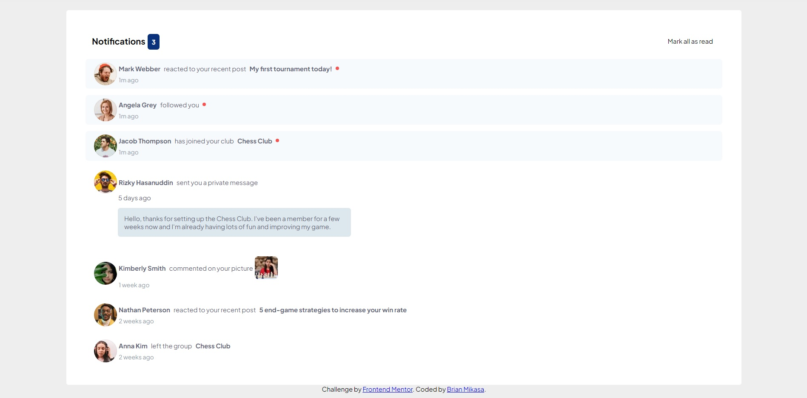

# Frontend Mentor - Notifications page solution

This is a solution to the [Notifications page challenge on Frontend Mentor](https://www.frontendmentor.io/challenges/notifications-page-DqK5QAmKbC). Frontend Mentor challenges help you improve your coding skills by building realistic projects. 

## Table of contents

- [Overview](#overview)
  - [The challenge](#the-challenge)
  - [Screenshot](#screenshot)
  - [Links](#links)
- [My process](#my-process)
  - [Built with](#built-with)
  - [What I learned](#what-i-learned)
  - [Continued development](#continued-development)
  - [Useful resources](#useful-resources)
- [Author](#author)
- [Acknowledgments](#acknowledgments)

## Overview

### The challenge

Users should be able to:

- Distinguish between "unread" and "read" notifications
- Select "Mark all as read" to toggle the visual state of the unread notifications and set the number of unread messages to zero
- View the optimal layout for the interface depending on their device's screen size
- See hover and focus states for all interactive elements on the page

### Screenshot



### Links

- Solution URL: [Add solution URL here](https://your-solution-url.com)
- Live Site URL: [Add live site URL here](https://your-live-site-url.com)

## My process

### Built with

- Semantic HTML5 markup
- CSS custom properties
- Flexbox
- CSS Grid-
-JavaScript


### What I learned

This project helped reinforce how to structure html and allowed me to implement javascript into a project. I really enjoyed the challenge of making the "Mark all as read" functionality work. Figuring that functionality out led me to 
learn about the 'foreach' method and made me more familiar with arrow functions. It's a very useful method for affecting a class that appears in multiple elements. I initially did it using a for loop and iterating through the '.unread' node but I ultimately settled on the 'foreach'
method because it looked cleaner. 

```js
const ui_all_unread = () => {
  let unread = document.querySelectorAll(".unread");
  let dots = document.querySelectorAll(".dot");

  unread.forEach((element) => element.classList.remove("unread"));
  dots.forEach((element) => element.classList.remove("dot"));
};
```

### Continued development

I still need to get better at structuring my html. I am getting better at making a mental picture of what my html structure will look like when it is displayed in a browser. 

I am looking forward to learning more CSS properties to do fancier styles. I need to get better at making my page more responsive. 

I am starting to get a grasp around javascript but I am only a couple weeks in. I hope to be able to smoothly write logic in the near future! 

### Useful resources

- [foreach method](https://www.w3schools.com/jsref/jsref_foreach.asp) - This page helped me understand the foreach method. Also, this youtube video (https://www.youtube.com/watch?v=6Hb0qZ3PVWI&ab_channel=CodewithAniaKub%C3%B3w) really broke is down in a very understandable way. 

**Note: Delete this note and replace the list above with resources that helped you during the challenge. These could come in handy for anyone viewing your solution or for yourself when you look back on this project in the future.**

## Author

- Github - [Brian Mikasa](https://github.com/gumlik)

## Acknowledgments

Thank you to The Odin Project discord community who've helped me light up my light bulb when i'm trying to grasp new concepts. Thanks to the random strangers on reddit and stackoverflow who answer all my questions!